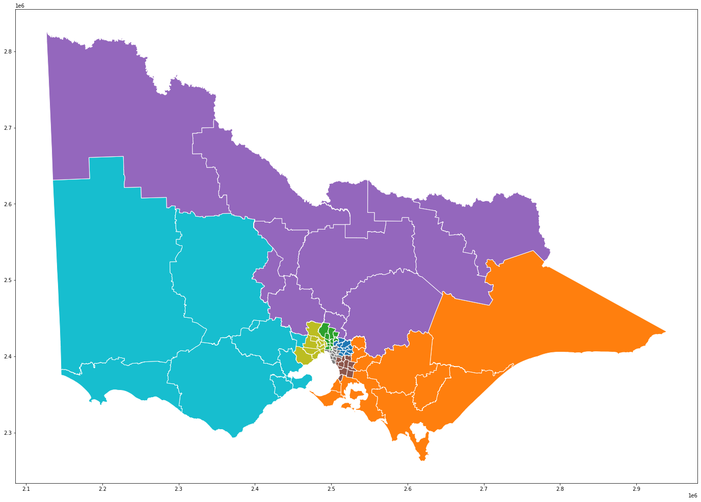
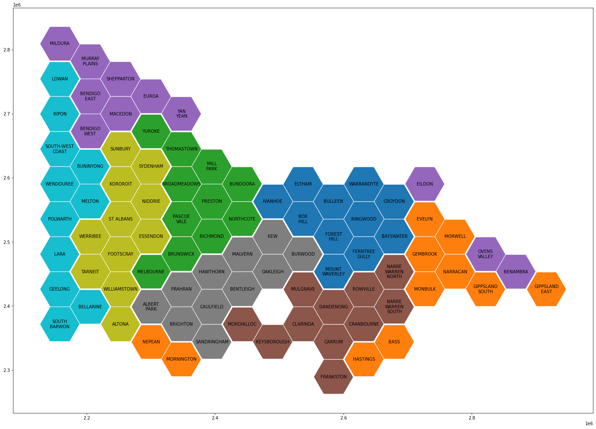

So I got all inspired by some of the US elction data viz, in partucular some of the mapping of states as abstract shapes with areas proportional to the number fo college votes they have. The issue is that without doing this, you see a lot less blue (Democrat) on a regular map than there really is (in terms of number of votes). This is due to many of the densely populated states tending to be blue-leaning (think north-east).

Well in Victoria, we have a similar issue, we have 88 lower house electorates, but 6 or 7 of them (by eyeball) cover more than half the state. So when you show a map of the electorates, these electorates swamp the viz, and the smaller (but just as populated) electorates shrink to invisibility.

I had a bit of a hunt for a library that dies what I want, but I couldn't see quite what I was after. This is a pretty rough attempt, but it is doing something not totally terrible.

